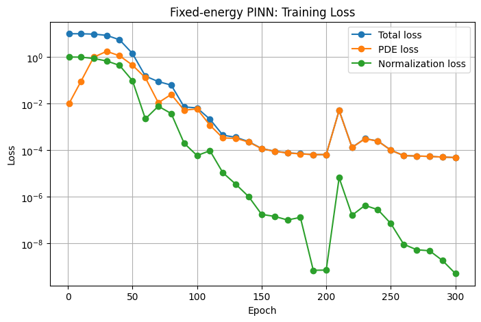
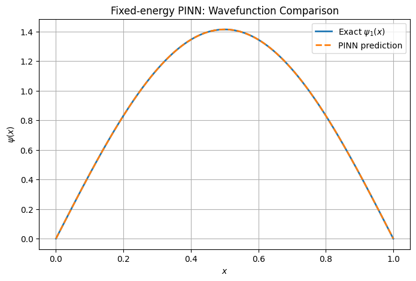
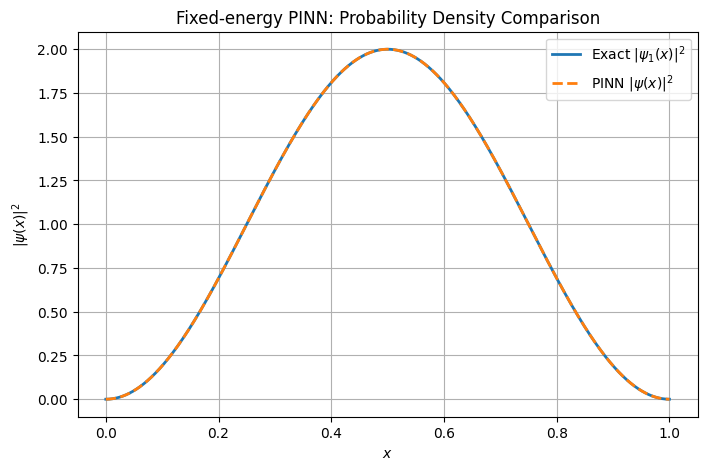
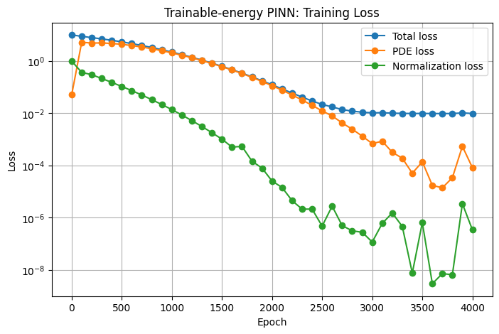
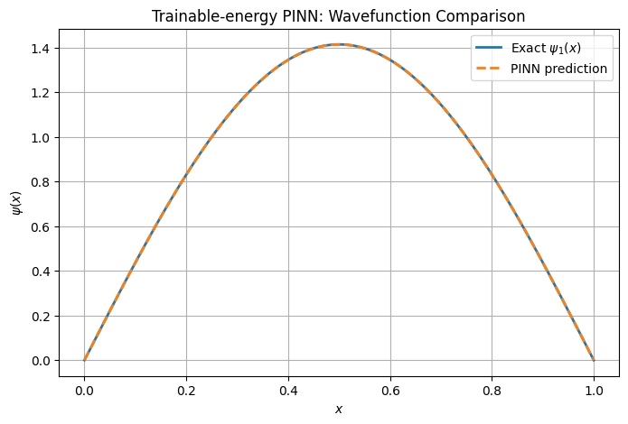
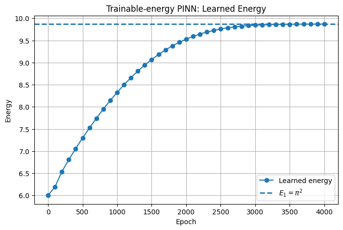

# Physics-Informed Neural Network for the 1D Schrödinger Equation

This project implements a **Physics-Informed Neural Network (PINN)** to solve the **1D time-independent Schrödinger equation** for a particle in an **infinite square well**.

The system is chosen because it has a known analytical solution, which makes it a useful benchmark problem for checking whether the PINN can learn a physically correct quantum wavefunction without using supervised labels.

---

## Problem statement

For a particle confined in a 1D infinite square well on

$$
x \in [0,1],
$$

the time-independent Schrödinger equation in nondimensional form is

$$
-\frac{d^2\psi(x)}{dx^2} = E\psi(x).
$$

The boundary conditions are

$$
\psi(0)=0, \qquad \psi(1)=0.
$$

The normalized analytical ground-state solution is

$$
\psi_1(x)=\sqrt{2}\sin(\pi x),
$$

with exact energy

$$
E_1=\pi^2.
$$

---

## PINN formulation

The neural network output is used to construct a wavefunction ansatz:

$$
\psi_\theta(x)=x(1-x)N_\theta(x),
$$

where $N_\theta(x)$ is the raw neural-network output. The factor $x(1-x)$ enforces the boundary conditions exactly.

The physics residual is

$$
R_\theta(x) = -\frac{d^2\psi_\theta(x)}{dx^2} - E\psi_\theta(x).
$$

The model is trained by minimizing the PDE residual and the normalization constraint:

$$
\int_0^1 |\psi_\theta(x)|^2 dx = 1.
$$

Two PINN cases are implemented:

1. **Fixed-energy PINN**: the exact energy $E=\pi^2$ is given, and the network learns only the wavefunction.
2. **Trainable-energy PINN**: the energy $E$ is treated as a trainable parameter, so the model learns both the wavefunction and the eigenvalue.

---

## Repository structure

```text
.
├── PINN_Schrodinger_Infinite_Square_Well.ipynb
├── README.md
└── assets/
    ├── fixed_energy_training_loss.png
    ├── fixed_energy_wavefunction_comparison.png
    ├── fixed_energy_probability_density.png
    ├── trainable_energy_training_loss.png
    ├── trainable_energy_wavefunction_comparison.png
    ├── trainable_energy_probability_density.png
    └── trainable_energy_learned_energy.png
```

---

## Requirements

The notebook uses:

```text
numpy
matplotlib
torch
```

Install them with:

```bash
pip install numpy matplotlib torch
```

---

## Results

### Fixed-energy PINN

In the fixed-energy case, the model is given the exact ground-state energy $E_1=\pi^2$. Therefore, the neural network only needs to learn the wavefunction.

<p align="center">
  
</p>

The PDE loss and normalization loss decrease rapidly, showing that the model learns a wavefunction satisfying both the differential equation and the normalization constraint.

<p align="center">
  
</p>

The predicted wavefunction overlaps almost perfectly with the analytical solution:

$$
\psi_1(x)=\sqrt{2}\sin(\pi x).
$$

<p align="center">
  
</p>

The probability density also matches the exact result:

$$
|\psi_1(x)|^2 = 2\sin^2(\pi x).
$$

The peak value reaches approximately 2, which is correct because this is a **probability density**, not a probability. The total probability is still normalized:

$$
\int_0^1 |\psi_1(x)|^2 dx = 1.
$$

---

### Trainable-energy PINN

In the trainable-energy case, the model learns both the wavefunction and the energy eigenvalue.

<p align="center">
  
</p>

The total loss decreases during training while the normalization loss becomes very small. This shows that the model is able to learn a normalized eigenfunction while also adjusting the energy parameter.

<p align="center">
  
</p>

The learned wavefunction agrees closely with the exact ground-state wavefunction.

<p align="center">
  
</p>

The predicted probability density also agrees well with the analytical density.

<p align="center">
  
</p>

The learned energy converges close to the exact ground-state value:

$$
E_1=\pi^2 \approx 9.8696.
$$

---

## Quantitative comparison

| Model | Predicted Energy | Exact Energy | Energy Absolute Error | Wavefunction MSE | Max Absolute Error | Normalization Integral |
|---|---:|---:|---:|---:|---:|---:|
| Fixed-energy PINN | 9.86960411 | 9.86960440 | 2.9037e-07 | 5.0294e-10 | 5.5015e-05 | 1.00003040 |
| Trainable-energy PINN | 9.86832428 | 9.86960440 | 1.2801e-03 | 1.6548e-07 | 6.3705e-04 | 0.99926758 |

---

## Key takeaway

This project demonstrates that a PINN can solve a quantum eigenvalue problem by using the governing differential equation as the training signal. The neural network is not trained using labeled wavefunction data. Instead, it learns by minimizing the Schrödinger-equation residual and satisfying the normalization and boundary constraints.

The fixed-energy model is simpler and more stable, while the trainable-energy model is more interesting because it learns the energy eigenvalue directly from the physics constraints.

---

## Possible extensions

Possible next steps include:

- learning excited states such as $n=2$ and $n=3$,
- adding orthogonality constraints between eigenstates,
- solving the finite square well,
- solving the harmonic oscillator,
- extending the method to the time-dependent Schrödinger equation.
